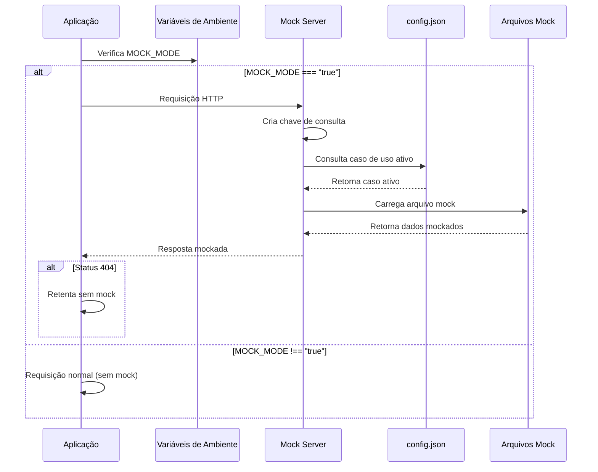
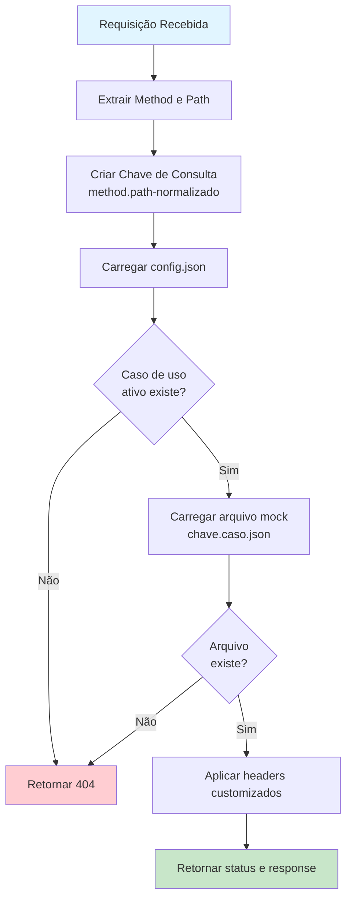
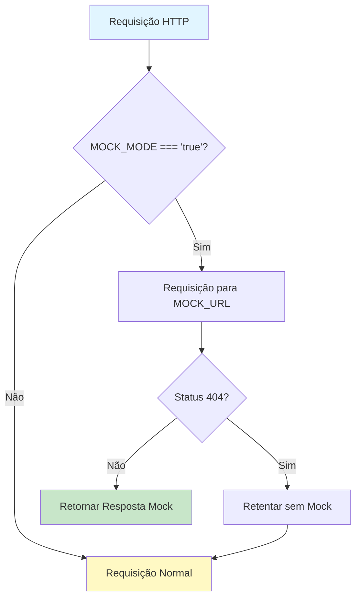
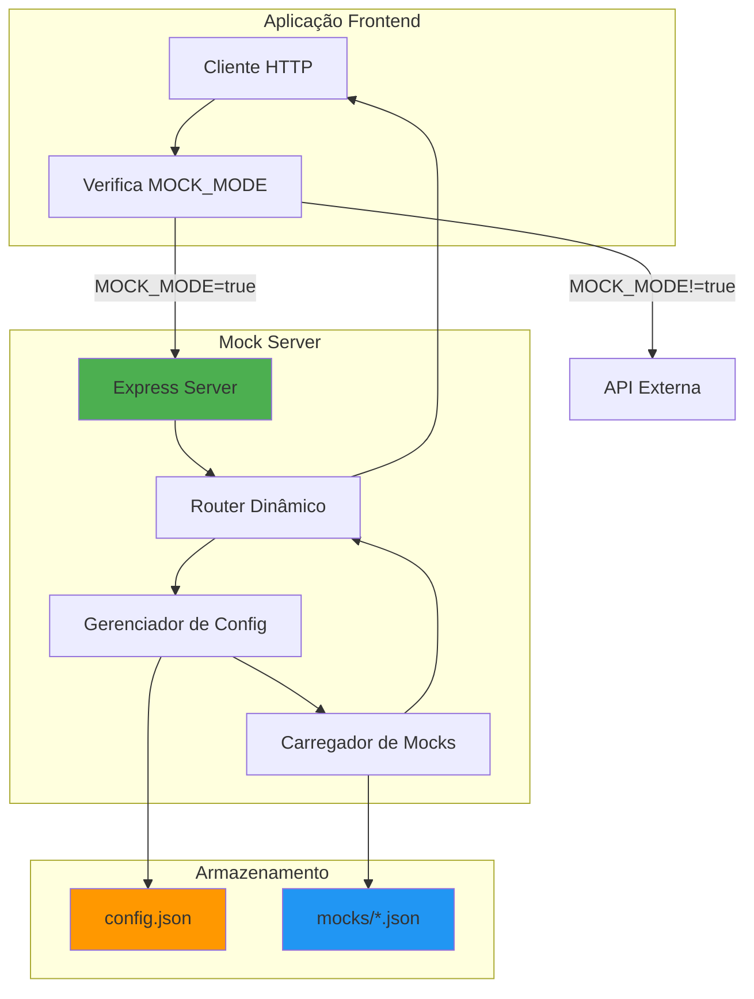

# Mock Server

API local para simulação de endpoints, permitindo testar diferentes cenários sem depender de APIs externas.

## 📋 Índice

- [Visão Geral](#visão-geral)
- [Como Funciona](#como-funciona)
- [Instalação e Execução](#instalação-e-execução)
- [Documentação Swagger](#documentação-swagger)
- [Estrutura de Arquivos](#estrutura-de-arquivos)
- [Criação de Chave de Consulta](#criação-de-chave-de-consulta)
- [Sistema de Configuração](#sistema-de-configuração)
- [Criação de Mocks](#criação-de-mocks)
- [APIs de Controle](#apis-de-controle)
- [Integração com Frontend](#integração-com-frontend)
- [Exemplos Práticos](#exemplos-práticos)

## 🎯 Visão Geral

O Mock Server é uma API Express simples que intercepta requisições HTTP e retorna respostas mockadas baseadas em arquivos JSON. Ele permite:

- Simular diferentes cenários de resposta (sucesso, erro, etc.)
- Alternar entre casos de uso sem alterar código
- Testar a aplicação sem depender de APIs externas
- Desenvolver e testar offline

## 🔄 Como Funciona

O fluxo de funcionamento do mock server pode ser visualizado no diagrama abaixo:



### Fluxo de Processamento de Requisição



## 🚀 Instalação e Execução

### Pré-requisitos

- Node.js >= 18
- npm ou yarn

### Instalação

```bash
cd mock-server
npm install
```

ou

```bash
cd mock-server
yarn install
```

### Execução

```bash
npm start
```

ou

```bash
yarn start
```

O servidor iniciará na porta **3001** por padrão. Você pode alterar a porta usando a variável de ambiente `PORT`:

```bash
PORT=8080 npm start
```

## 📚 Documentação Swagger

O mock-server inclui documentação Swagger/OpenAPI completa e interativa. Após iniciar o servidor, acesse:

**http://localhost:3001/api-docs**

### Funcionalidades da Documentação

- **Interface Interativa**: Teste todas as APIs diretamente pelo navegador
- **Documentação Completa**: Todas as rotas documentadas com exemplos
- **Schemas de Request/Response**: Estruturas detalhadas de dados
- **Códigos de Status**: Documentação de todas as respostas possíveis

### Endpoints Documentados

A documentação Swagger inclui:

1. **GET /config** - Visualizar configuração atual
2. **POST /config** - Atualizar configuração
3. **GET /endpoints** - Listar todos os endpoints mockados
4. **POST /endpoints** - Consultar endpoints com filtros
5. **Rotas Dinâmicas** - Documentação genérica para endpoints mockados (GET, POST, PUT, DELETE)

### Usando a Interface Swagger

1. Acesse `http://localhost:3001/api-docs` no navegador
2. Explore os endpoints disponíveis na lista lateral
3. Clique em um endpoint para ver detalhes
4. Use o botão "Try it out" para testar a API diretamente
5. Veja exemplos de request e response para cada endpoint

## 📁 Estrutura de Arquivos

```
mock-server/
├── server.js           # Servidor Express principal
├── package.json        # Dependências do projeto
├── config.json         # Configuração de casos de uso ativos
├── mocks/              # Pasta com arquivos de mock
│   ├── get.api-users.success.json
│   ├── get.api-users.error.json
│   └── ...
└── README.md           # Esta documentação
```

## 🔑 Criação de Chave de Consulta

A chave de consulta é criada automaticamente a partir do método HTTP e do path da requisição:

**Formato:** `{method}.{path-normalizado}`

### Regras de Normalização

1. O método HTTP é convertido para minúsculas
2. Barras (`/`) são substituídas por hífens (`-`)
3. A barra inicial é removida se existir

### Exemplos

| Método | Path Original | Chave de Consulta |
|--------|--------------|-------------------|
| GET | `/api/users` | `get.api-users` |
| POST | `/api/auth/login` | `post.api-auth-login` |
| PUT | `/api/users/123` | `put.api-users-123` |
| DELETE | `/api/users/123` | `delete.api-users-123` |

## ⚙️ Sistema de Configuração

O arquivo `config.json` controla qual caso de uso está ativo para cada endpoint. Apenas **um caso de uso pode estar ativo por vez** para cada chave de consulta.

### Estrutura do config.json

```json
{
  "{chave-de-consulta}": {
    "{caso-de-uso-1}": true,
    "{caso-de-uso-2}": false,
    "{caso-de-uso-3}": false
  }
}
```

### Exemplo Prático

```json
{
  "get.api-users": {
    "success": true,
    "error": false,
    "empty": false
  },
  "post.api-auth-login": {
    "success": true,
    "invalid_credentials": false,
    "account_locked": false
  }
}
```

Neste exemplo:
- Para `get.api-users`, o caso `success` está ativo
- Para `post.api-auth-login`, o caso `success` está ativo

### Alterando o Caso de Uso Ativo

Para alterar qual caso de uso está ativo, você pode:

1. **Editar manualmente o config.json:**
   ```json
   {
     "get.api-users": {
       "success": false,
       "error": true
     }
   }
   ```

2. **Usar a API POST /config:**
   ```bash
   curl -X POST http://localhost:3001/config \
     -H "Content-Type: application/json" \
     -d '{
       "get.api-users": {
         "success": false,
         "error": true
       }
     }'
   ```

## 📝 Criação de Mocks

Cada mock é um arquivo JSON na pasta `mocks/` com o seguinte formato de nome:

**Formato:** `{chave-de-consulta}.{caso-de-uso}.json`

### Estrutura do Arquivo Mock

```json
{
  "status": 200,
  "response": {
    // Dados da resposta aqui
  },
  "headers": {
    // Headers customizados (opcional)
  }
}
```

### Campos

- **`status`** (obrigatório): Código HTTP de status (200, 400, 500, etc.)
- **`response`** (obrigatório): Objeto com os dados da resposta
- **`headers`** (opcional): Objeto com headers customizados a serem retornados

### Exemplo Completo

**Arquivo:** `mocks/get.api-users.success.json`

```json
{
  "status": 200,
  "response": {
    "users": [
      {
        "id": 1,
        "name": "John Doe",
        "email": "john@example.com"
      }
    ],
    "total": 1
  },
  "headers": {
    "Content-Type": "application/json",
    "X-Custom-Header": "valor-customizado"
  }
}
```

**Arquivo:** `mocks/get.api-users.error.json`

```json
{
  "status": 500,
  "response": {
    "error": "Internal server error",
    "message": "Unable to fetch users. Please try again."
  }
}
```

## 🎮 APIs de Controle

O mock server fornece APIs auxiliares para gerenciar configurações e consultar endpoints.

### GET /config

Retorna o arquivo `config.json` completo.

**Exemplo de Requisição:**
```bash
curl http://localhost:3001/config
```

**Exemplo de Resposta:**
```json
{
  "get.api-users": {
    "success": true,
    "error": false
  },
  "post.api-auth-login": {
    "success": true,
    "invalid_credentials": false
  }
}
```

### POST /config

Sobrescreve completamente o arquivo `config.json` com o body enviado.

**Exemplo de Requisição:**
```bash
curl -X POST http://localhost:3001/config \
  -H "Content-Type: application/json" \
  -d '{
    "get.api-users": {
      "success": false,
      "error": true
    }
  }'
```

**Exemplo de Resposta:**
```json
{
  "success": true,
  "message": "Config atualizado com sucesso",
  "config": {
    "get.api-users": {
      "success": false,
      "error": true
    }
  }
}
```

### GET /endpoints

Retorna todos os endpoints disponíveis, organizados por chave de consulta, incluindo todos os casos de uso e seus responses.

**Exemplo de Requisição:**
```bash
curl http://localhost:3001/endpoints
```

**Exemplo de Resposta:**
```json
{
  "get.api-users": {
    "activeUseCase": "success",
    "useCases": {
      "success": {
        "status": 200,
        "response": {
          "users": []
        }
      },
      "error": {
        "status": 500,
        "response": {
          "error": "Internal server error"
        }
      }
    }
  },
  "post.api-auth-login": {
    "activeUseCase": "success",
    "useCases": {
      "success": {
        "status": 200,
        "response": {
          "token": "abc123"
        }
      }
    }
  }
}
```

### POST /endpoints

Consulta endpoints com filtros opcionais. Permite filtrar por `queryKey`, `useCase` ou ambos.

**Body da Requisição:**
```json
{
  "queryKey": "get.api-users",  // opcional
  "useCase": "success"           // opcional
}
```

**Exemplos:**

1. **Filtrar por queryKey e useCase:**
   ```bash
   curl -X POST http://localhost:3001/endpoints \
     -H "Content-Type: application/json" \
     -d '{
       "queryKey": "get.api-users",
       "useCase": "success"
     }'
   ```

2. **Filtrar apenas por queryKey:**
   ```bash
   curl -X POST http://localhost:3001/endpoints \
     -H "Content-Type: application/json" \
     -d '{
       "queryKey": "get.api-users"
     }'
   ```

3. **Filtrar apenas por useCase:**
   ```bash
   curl -X POST http://localhost:3001/endpoints \
     -H "Content-Type: application/json" \
     -d '{
       "useCase": "success"
     }'
   ```

4. **Sem filtros (retorna tudo):**
   ```bash
   curl -X POST http://localhost:3001/endpoints \
     -H "Content-Type: application/json" \
     -d '{}'
   ```

## 🔌 Integração com Frontend

Para integrar o mock server na aplicação, você precisa modificar o cliente HTTP (axios, fetch, etc.) para verificar a variável de ambiente `MOCK_MODE` e redirecionar requisições quando necessário.

### Fluxo de Integração



### Exemplo de Implementação (Axios)

```javascript
import axios from 'axios';

const MOCK_MODE = process.env.MOCK_MODE;
const MOCK_URL = process.env.MOCK_URL || 'http://localhost:3001';
const BASE_URL = process.env.BASE_URL;

// Interceptor de requisição
axios.interceptors.request.use(async (config) => {
  if (MOCK_MODE === 'true') {
    // Substitui a URL base pela URL do mock
    const originalUrl = config.url;
    config.url = `${MOCK_URL}${originalUrl}`;
    
    // Adiciona flag para identificar que é uma requisição mock
    config._isMockRequest = true;
  }
  
  return config;
});

// Interceptor de resposta
axios.interceptors.response.use(
  (response) => response,
  async (error) => {
    // Se for requisição mock e retornar 404, tenta sem mock
    if (error.config?._isMockRequest && error.response?.status === 404) {
      // Remove a flag e restaura URL original
      delete error.config._isMockRequest;
      error.config.url = error.config.url.replace(MOCK_URL, BASE_URL);
      
      // Retenta a requisição
      return axios.request(error.config);
    }
    
    return Promise.reject(error);
  }
);
```

### Variáveis de Ambiente Necessárias

Adicione as seguintes variáveis ao seu arquivo de ambiente:

```json
{
  "MOCK_MODE": "true",
  "MOCK_URL": "http://localhost:3001",
  "BASE_URL": "https://api.example.com"
}
```

**Nota:** Quando `MOCK_MODE` não for `"true"` (string), as requisições seguirão normalmente para `BASE_URL`.

## 💡 Exemplos Práticos

### Exemplo 1: Mock de Listagem de Usuários

**1. Criar o arquivo de mock:**
`mocks/get.api-users.success.json`
```json
{
  "status": 200,
  "response": {
    "users": [
      {
        "id": 1,
        "name": "John Doe",
        "email": "john@example.com"
      }
    ],
    "total": 1
  }
}
```

**2. Configurar no config.json:**
```json
{
  "get.api-users": {
    "success": true
  }
}
```

**3. Testar:**
```bash
curl http://localhost:3001/api/users
```

### Exemplo 2: Mock de Erro de Autenticação

**1. Criar o arquivo de mock:**
`mocks/post.api-auth-login.invalid_credentials.json`
```json
{
  "status": 401,
  "response": {
    "error": "Invalid credentials",
    "message": "Email or password is incorrect"
  }
}
```

**2. Ativar o caso de uso:**
```bash
curl -X POST http://localhost:3001/config \
  -H "Content-Type: application/json" \
  -d '{
    "post.api-auth-login": {
      "success": false,
      "invalid_credentials": true
    }
  }'
```

**3. Testar:**
```bash
curl -X POST http://localhost:3001/api/auth/login \
  -H "Content-Type: application/json" \
  -d '{"email": "user@example.com", "password": "wrongpass"}'
```

### Exemplo 3: Consultar Todos os Endpoints

```bash
curl http://localhost:3001/endpoints | jq
```

### Exemplo 4: Filtrar Endpoints por Caso de Uso

```bash
curl -X POST http://localhost:3001/endpoints \
  -H "Content-Type: application/json" \
  -d '{"useCase": "error"}' | jq
```

## 📊 Diagrama de Arquitetura



## 🎯 Boas Práticas

1. **Nomenclatura Consistente:** Use nomes descritivos para casos de uso (ex: `success`, `error`, `not_found`, `unauthorized`)

2. **Organização:** Mantenha os arquivos de mock organizados e com nomes claros

3. **Documentação:** Documente casos de uso complexos nos próprios arquivos JSON usando comentários (se necessário)

4. **Versionamento:** Mantenha o `config.json` versionado para facilitar o trabalho em equipe

5. **Testes:** Use diferentes casos de uso para testar todos os cenários da aplicação

## 🐛 Troubleshooting

### Mock não está sendo retornado

1. Verifique se a chave de consulta está correta (método + path normalizado)
2. Confirme que o caso de uso está marcado como `true` no `config.json`
3. Verifique se o arquivo mock existe na pasta `mocks/`
4. Confira os logs do servidor para erros

### Erro 404 ao consultar mock

- O endpoint não está configurado no `config.json`
- O arquivo de mock não existe
- A chave de consulta está incorreta

### Headers não estão sendo aplicados

- Verifique se o campo `headers` existe no arquivo JSON
- Confirme que os headers estão no formato correto (objeto chave-valor)

## 📚 Recursos Adicionais

- [Documentação Express](https://expressjs.com/)
- [Node.js File System](https://nodejs.org/api/fs.html)
- [Swagger/OpenAPI](https://swagger.io/specification/)
- [Swagger UI Express](https://github.com/scottie1984/swagger-ui-express)

## 🔍 Acessando a Documentação

Após iniciar o servidor, você pode acessar:

- **Swagger UI**: http://localhost:3001/api-docs
- **API Endpoints**: http://localhost:3001/config, http://localhost:3001/endpoints

---

